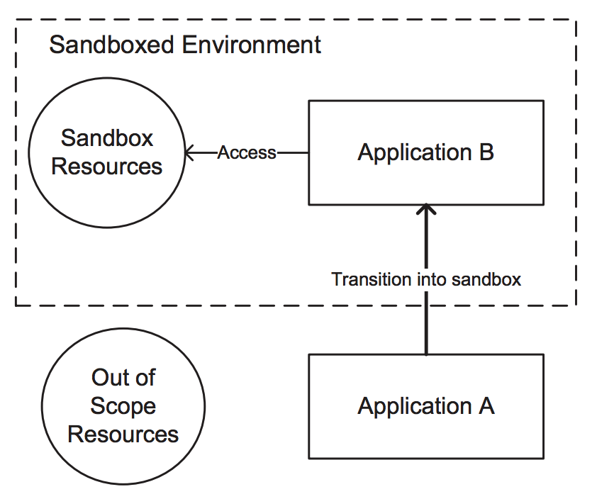
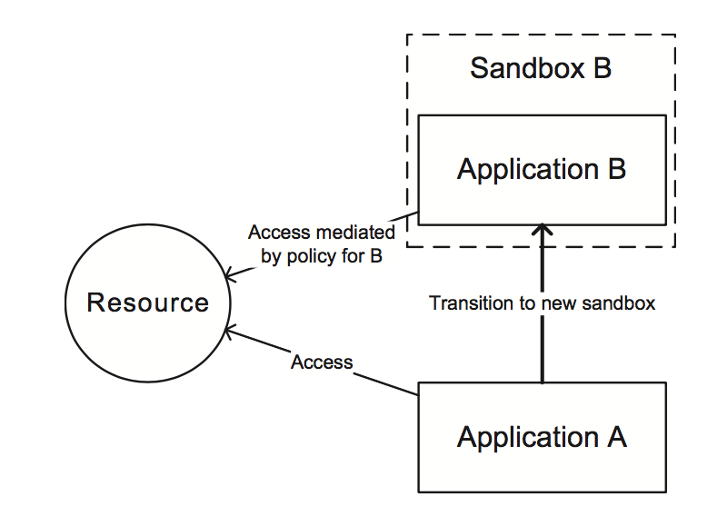

# 引言

随着网络全球化的发展，安全越来越成为了一个进入大众视野的议题。互联网在提供给用户以便利的同时，也对隐私安全提出了新的挑战。这样的问题存在于各种平台上，攻击者会将诸如木马、病毒、恶意软件等等内容发布到被攻击者的终端上。[miwa] 虽然现在的操作系统上的安全措施已经足够强大到防止绝大多数的攻击，但是用户总是期望更加安全的环境。而沙箱是一种非常实用的安全机制，通过引入沙箱技术，程序可以在隔离的环境中运行，使得程序的运行不会影响操作系统，同时操作系统也不会影响到程序。在传统的操作系统的抽象中，用户的应用对于系统各种资源的使用都是无限制的，而沙箱技术是对其运行时环境的隔离 [sandbox]。

沙箱技术大致可以被分为两类，其中第一类是基于隔离的沙箱，该类型的沙箱将应用的执行环境从操作系统中隔离出来，形成一个独立的执行环境。图 1 展示了一个经典的基于隔离的沙箱模型。一个应用程序会在启动另一个应用程序之前先启动应用程序的沙箱，然后在沙箱内运行该应用程序，沙箱内的应用程序只能访问到沙箱内的资源。广为人知的虚拟机，容器，和传统意义上的沙箱都是这一类的沙箱模型。

第二类是基于规则的沙箱，该类型的沙箱并不是完全关注于对于应用程序的隔离上，而是用规则的方式控制每个应用的权限，基于规则的沙箱之间可以分享操作系统的逻辑资源。图 2 展示了第二类的沙箱模型，不同于基于隔离的沙箱模型的地方在于，基于规则的沙箱模型并没有实现完全的资源隔离，而是对于每个应用，有不同的限制策略，通过强制应用限制策略来保证资源的访问权限受控 [schreuders]。

由于篇幅限制，本文不能面面俱到地对各种沙箱技术都予以介绍，为了保证深度，本文选取第一类沙箱中的 Software-based Fault Isolation，以及第二类沙箱中的 System Call Interposition 和 Capabilities，来介绍沙箱技术的应用场景与实现，以及各自的优缺点，并在文末展开对各种技术的实现原理和潜在研究点的讨论。

## Reference

* [sandbox] Borate, Imamjafar, and R. K. Chavan. "Sandboxing in Linux: From Smartphone to Cloud." International Journal of Computer Applications 148.8 (2016).
* [miwa] Miwa, Shinsuke, et al. "Design and Implementation of an Isolated Sandbox with Mimetic Internet Used to Analyze Malwares." DETER. 2007.
* [schreuders] Schreuders, Z. Cliffe, Tanya McGill, and Christian Payne. "The state of the art of application restrictions and sandboxes: A survey of application-oriented access controls and their shortfalls." Computers & Security 32 (2013): 219-241.
